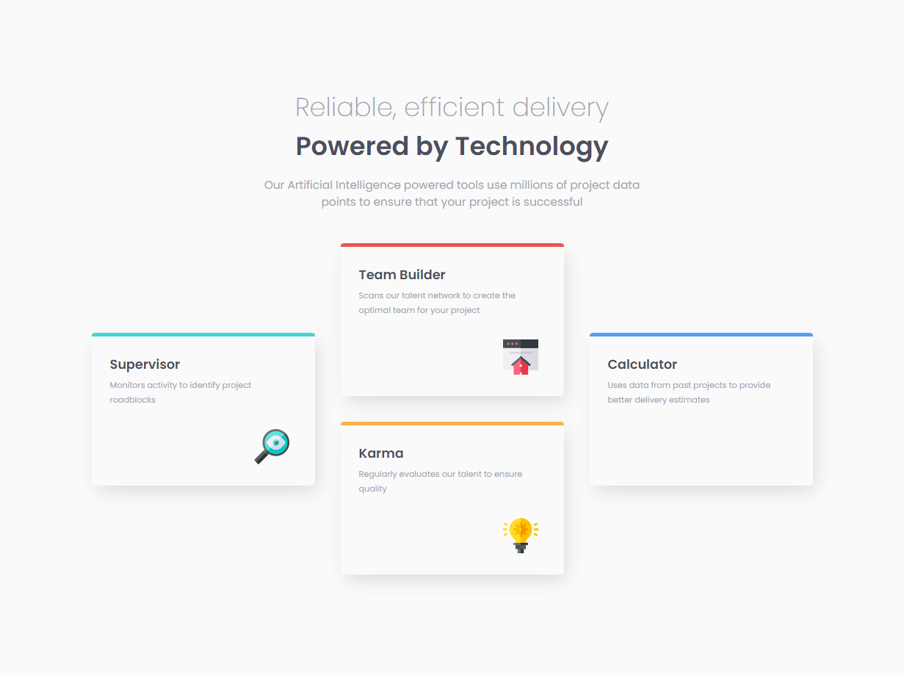
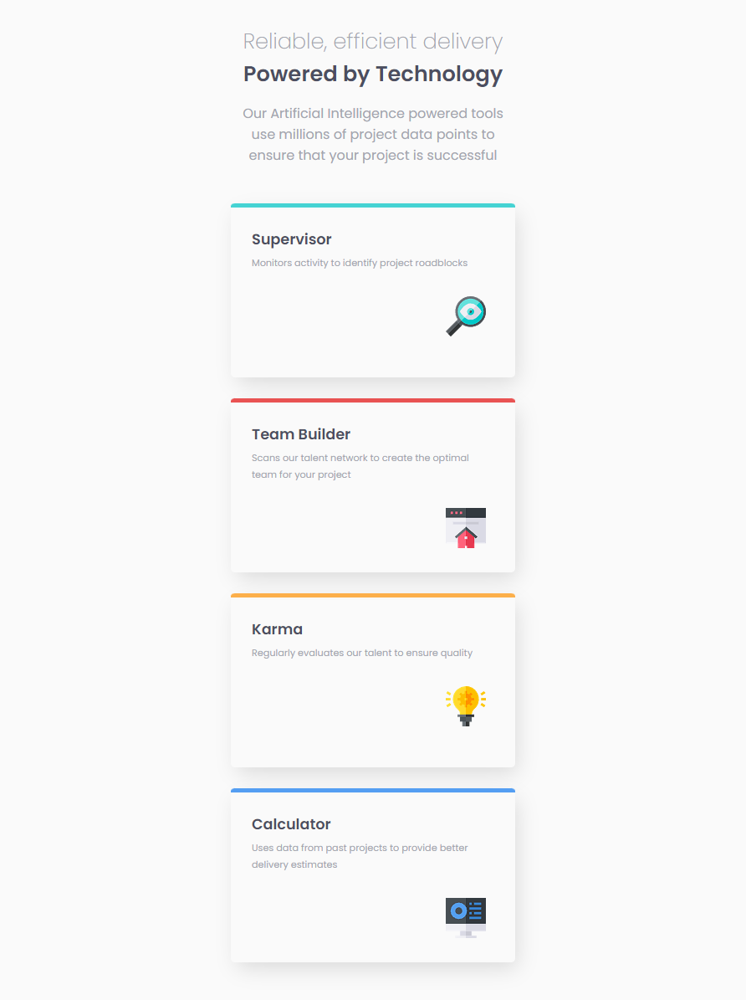

# Frontend Mentor - Four card feature section solution

This is a solution to the [Four card feature section challenge on Frontend Mentor](https://www.frontendmentor.io/challenges/four-card-feature-section-weK1eFYK). Frontend Mentor challenges help you improve your coding skills by building realistic projects.

## Table of contents

- [Overview](#overview)
  - [The challenge](#the-challenge)
  - [Screenshot](#screenshot)
  - [Links](#links)
- [My process](#my-process)
  - [Built with](#built-with)
  - [What I learned](#what-i-learned)
  - [Continued development](#continued-development)
- [Author](#author)

## Overview

### The challenge

Users should be able to:

- View the optimal layout for the site depending on their device's screen size.

### Screenshot





### Links

- Solution URL: [Solution URL](https://github.com/TrEv0rRrRr/Four-card-feature-section)
- Live Site URL: [Live site URL](https://trev0rrrrr.github.io/Four-card-feature-section/)

## My process

### Built with

- Semantic HTML5 markup
- CSS custom properties
- Flexbox
- CSS Grid

### What I learned

```css
@media screen and (max-width: 1063px) {
  .container {
    max-width: 25rem;
    margin: 15px;
  }
}

@media screen and (max-width: 1063px) {
  h1,
  .p-header-title {
    font-size: 1.6rem;
  }

  .p-header-desc {
    font-size: 1rem;
    text-wrap: balance;
  }

  span {
    display: inline;
  }
}

@media screen and (max-width: 1063px) {
  main {
    display: flex;
    justify-content: center;
  }

  .main__div {
    display: grid;
    grid-template-columns: none;
    grid-template-areas:
      "supervisor"
      "builder"
      "karma"
      "calculator";
    gap: 25px;
  }
}
```

## Author

- Frontend Mentor - [@TrEv0rRrRr](https://www.frontendmentor.io/profile/TrEv0rRrRr)
